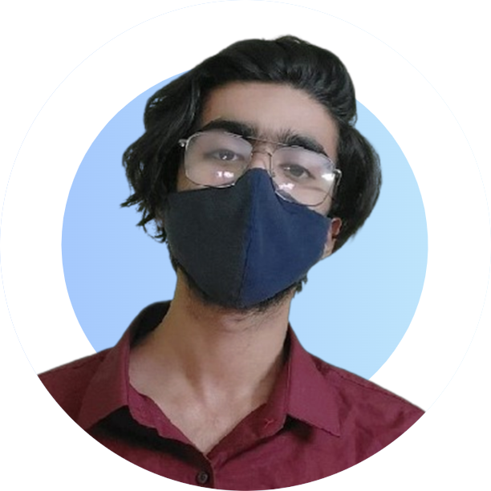

<!-- 

  
   
  <h5 align="center">console.log('Forever Explorer');</h5>

 </-->

<!-- ----------- HEAD SECTION ------------ -->

  

## About

I am Arjunan K. I'm an Undergraduate student from the St. Thomas College (University of Calicut) Kerala, India. I am mainly focused towards Data Science and Machine Learning and have done my projects and internships under the same. I’m looking to collaborate on Data Projects. My other interests aside from Data Science are Cloud, Teaching and Mentoring.

<table>
  <tr>
    <td></td>
    <td></td>
    <td></td>
  </tr>
</table>

<!-- ## Timeline
- Academic Tutor
- Software Engineer [CatalyzeX](https://www.catalyzex.com/) (Sept 2022 - Present)
- Software Engineer [PropertyLoop](https://propertyloop.co.uk/more-info) (Aug 2022 - Sept 2022)
- MLH Fellow @Solana, [MLH Fellowship](https://fellowship.mlh.io/) (May 2022 - Aug 2022)
- Student Developer, [Google Summer of code](https://summerofcode.withgoogle.com/) (May 2022 - Sept 2022)</-->

## Github Stats

 

<!--  -->

<!-- 
 
  

 
  
   </-->
